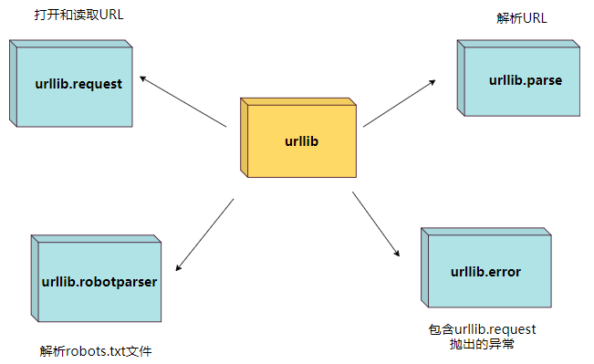

# 基础类库

基于选择和练习的学习，目的建立一个Python爬虫的框架。

## Urllib 伪装请求 -> 用不到

### Urllib 的四个模块

* **request:** 打开和读取URL。
  
* **error:** 异常

* **parse（解析）:** 解析 URL

* **robotparser（机器人）:** 解析 robots.txt



#### 语法规则

```python
    urllib.request.urlopen(url, data=None, [timeout, ]*, cafile=None, capath=None, cadefault=False, context=None)
```

* url：url 地址。
* data：发送到服务器的其他数据对象，默认为 None。
* timeout：设置访问超时时间。
* cafile 和 capath：cafile 为 CA 证书， capath 为 CA 证书的路径，使用HTTPS 需要用到。
* cadefault：已经被弃用。
* context：ssl.SSLContext类型，用来指定 SSL 设置。

#### 第一个爬虫程序

```python

```

## Requests 多种请求 --> url 升级版

## 正则（了解）

## BeautifulSoup 代替正则
