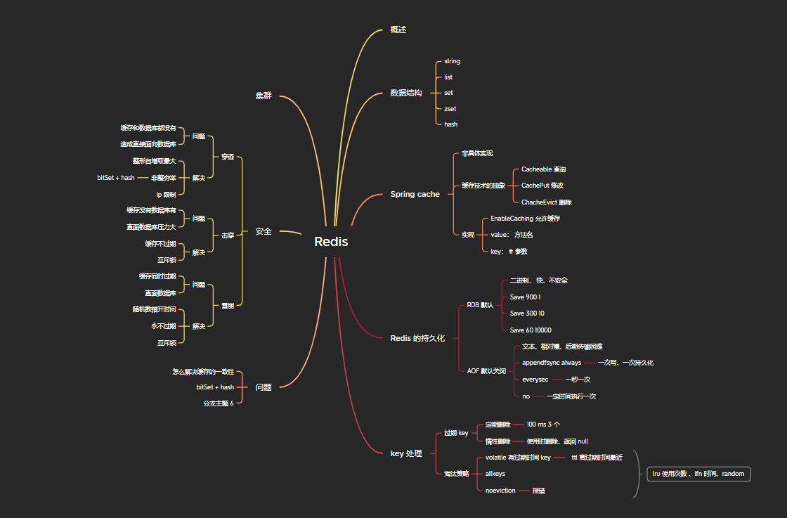

# Redis.md

## 概述

>**Redis**一款基于 Key-Value 的 NoSQL 数据库,基于内存存储数据，提供多种持久化机制，性能强悍，提供主从，哨兵以及集群的大家方式，更方便横向扩张以及垂直扩展

### 关系数据库和非关系数据库

**sql 关系型:** 结构完整，一定需要长久保存的数据库  

**nosql 非关系型：** 结构凌乱 不需要长久保存的数据

### 使用场景

1. 缓存
2. 排行榜
3. 计算器/限速器
4. 好友关系
5. 简单消息队列
6. Session 共享
7. 分布式锁

## 数据类型

### 常用数据类型

#### String 字符串

#### List 列表

#### Set 集合

#### Hash 散列

#### Zset 有序集合

* string 类型元素的集合，不允许重复成员，每个元素关联一个 double 类型的分数，可以通过分数进行排序
  
```shell
    // zadd 添加成员
    zadd zset-key score member
    // 增量
    zincrby key increment member
    // 排序
    zrange zset-key -inf +inf withscore 
    // 如果存在就删除
    zrem zset-key member
```

### 三种特殊类型

#### HyperLogLogs 基数统计

#### Bitmaps 位图

#### Gespatial 地理位置

### Stream 可持久化消息队列
